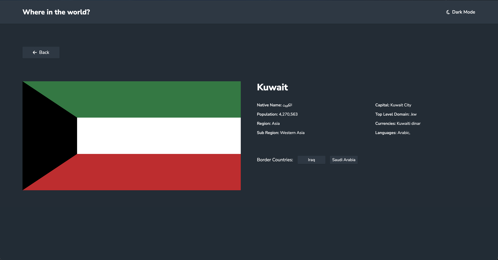

# Frontend Mentor - REST Countries API with color theme switcher solution

This is a solution to the [REST Countries API with color theme switcher challenge on Frontend Mentor](https://www.frontendmentor.io/challenges/rest-countries-api-with-color-theme-switcher-5cacc469fec04111f7b848ca). Frontend Mentor challenges help you improve your coding skills by building realistic projects. 

## Table of contents

- [Overview](#overview)
  - [The challenge](#the-challenge)
  - [Screenshot](#screenshot)
  - [Links](#links)
- [My process](#my-process)
  - [Built with](#built-with)
  - [What I learned](#what-i-learned)
  - [Continued development](#continued-development)
  - [Useful resources](#useful-resources)
  - [AI Collaboration](#ai-collaboration)
- [Author](#author)
- [Acknowledgments](#acknowledgments)

**Note: Delete this note and update the table of contents based on what sections you keep.**

## Overview

### The challenge

Users should be able to:

- See all countries from the API on the homepage
- Search for a country using an `input` field
- Filter countries by region
- Click on a country to see more detailed information on a separate page
- Click through to the border countries on the detail page
- Toggle the color scheme between light and dark mode *(optional)*

### Screenshot

### Links

- Solution URL: [https://github.com/alsheha88/rest-countries]
- Live Site URL: [Add live site URL here]

### Built with

- Semantic HTML5 markup
- CSS custom properties
- Flexbox
- CSS Grid
- Mobile-first workflow
- Tailwind v4
- [React](https://reactjs.org/) - TS library

### What I learned

Started working with REACT, TypeScript and Tailwind. getting comfortable in writing type safe code. Learnt context hook, state, useEffect and Router. will keep learning until i get really comfortable with using those concepts.

### Continued development

Continue to learn REACT, TS and tailwind till I`m production ready.

### Useful resources

- [https://www.typescriptlang.org/docs/] - Great documentation that explains the basics of TS.
- [https://react.dev/learn] - Great documentation that explains the basics of REACT.

## Author

- Website - [https://github.com/alsheha88](https://www.your-site.com)
- Frontend Mentor - [@alsheha88]

